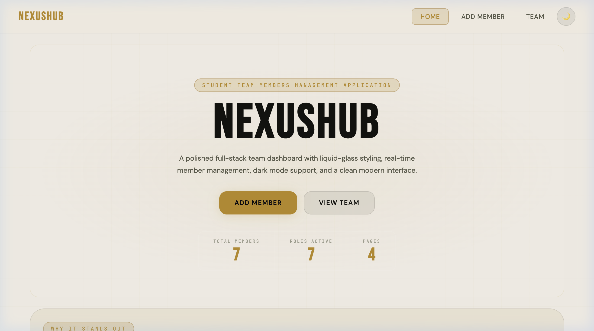
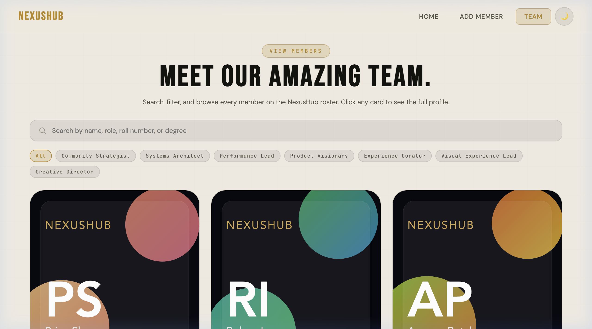
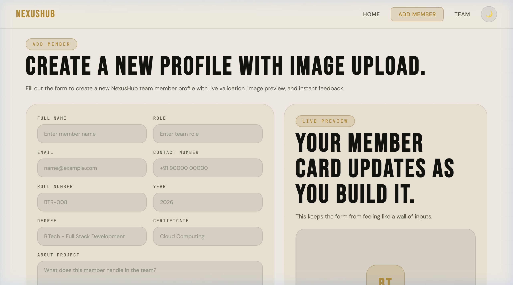
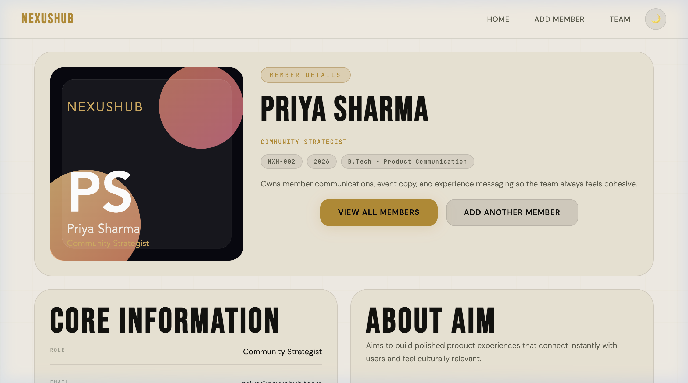

# NexusHub

Student Team Members Management Application built with React, Node.js, Express, and MongoDB.

```
 ███╗   ██╗███████╗██╗  ██╗██╗   ██╗███████╗██╗  ██╗██╗   ██╗██████╗
 ████╗  ██║██╔════╝╚██╗██╔╝██║   ██║██╔════╝██║  ██║██║   ██║██╔══██╗
 ██╔██╗ ██║█████╗   ╚███╔╝ ██║   ██║███████╗███████║██║   ██║██████╔╝
 ██║╚██╗██║██╔══╝   ██╔██╗ ██║   ██║╚════██║██╔══██║██║   ██║██╔══██╗
 ██║ ╚████║███████╗██╔╝ ██╗╚██████╔╝███████║██║  ██║╚██████╔╝██████╔╝
 ╚═╝  ╚═══╝╚══════╝╚═╝  ╚═╝ ╚═════╝ ╚══════╝╚═╝  ╚═╝ ╚═════╝ ╚═════╝
```

> Course: 21CSS301T – Full Stack Development | Assessment: CLAT-2 | Batch: 2023

---

## 📸 Screenshots

<table>
  <tr>
    <td align="center" width="50%">
      <b>🏠 Home Page</b><br/><br/>
      
    </td>
    <td align="center" width="50%">
      <b>👥 View Members</b><br/><br/>
      
    </td>
  </tr>
  <tr>
    <td align="center" width="50%">
      <b>➕ Add Member</b><br/><br/>
      
    </td>
    <td align="center" width="50%">
      <b>🪪 Member Details</b><br/><br/>
      
    </td>
  </tr>
</table>

---

## 🔗 Live Dev Links

| Service | URL |
|---------|-----|
| **Frontend** | http://localhost:5173 |
| **Backend API** | http://localhost:5000 |
| **Health check** | http://localhost:5000/api/health |
| **Members JSON** | http://localhost:5000/api/members |

> **Note:** If port 5173 is already in use, Vite will automatically increment to the next available port (e.g. `http://localhost:5174`). Check the terminal output for the exact URL after running `npm run dev`.

---

## Features

- **4 Pages** — Home, Add Member, View Team, Member Details
- **Liquid Glass UI** — Gold-accent dark/light design system with `backdrop-filter` blur cards
- **Bebas Neue** display font · **DM Sans** body · **JetBrains Mono** labels
- **Dark / Light Mode** — Persistent via `localStorage` + `data-theme` attribute on `:root`, managed through `ThemeContext`
- **Image Upload** — Multipart form upload stored in `backend/uploads/runtime/`
- **Form Validation** — 13 required fields with real-time inline error display
- **Live Preview** — Member card preview panel updates in real-time as the form is filled
- **Auto-seed** — 7 NexusHub team members seeded automatically on first launch
- **Horizontal roster scroll** — Members strip on Home page scrolls left/right with snap behaviour
- **Search + Filter** — View Team page supports live search and role-chip filtering (deferred via `useDeferredValue`)
- **Responsive** — Works on mobile, tablet, and desktop

---

## Team

| # | Name | Role |
|---|------|------|
| 1 | Aryan Mehta | Creative Director |
| 2 | Priya Sharma | Community Strategist |
| 3 | Rohan Iyer | Systems Architect |
| 4 | Ananya Patel | Performance Lead |
| 5 | Karan Verma | Product Visionary |
| 6 | Neha Joshi | Experience Curator |
| 7 | Vikram Nair | Visual Experience Lead |

---

## Tech Stack

| Layer | Tools |
|-------|-------|
| Frontend | React 18, React Router v6, Axios, Vite 5 |
| Styling | Custom CSS — Bebas Neue, DM Sans, JetBrains Mono, gold accent design system |
| Backend | Node.js, Express, Multer |
| Database | MongoDB + Mongoose (with JSON fallback for zero-setup demo) |
| Dev tooling | Concurrently, Nodemon, ESLint |

---

## Project Structure

```text
FSD_assignment/
├── backend/
│   ├── data/                   # JSON fallback storage (demo-members.json)
│   ├── src/
│   │   ├── controllers/        # listMembers, getMemberDetails, addMember
│   │   ├── data/               # sampleMembers.js (seed data)
│   │   ├── models/             # Mongoose Member schema
│   │   ├── routes/             # /api/members routes
│   │   ├── store/              # memberStore.js (JSON + MongoDB adapter)
│   │   └── utils/              # serialization, validation, paths
│   ├── uploads/                # Seeded SVG avatars
│   │   └── runtime/            # User-uploaded images (git-ignored)
│   ├── .env.example
│   └── server.js
├── frontend/
│   ├── src/
│   │   ├── components/         # AppLayout, MemberCard, ThemeToggle,
│   │   │                       # GlassPanel, SectionHeader, EmptyState, LoadingState
│   │   ├── context/            # ThemeContext (dark/light state + localStorage)
│   │   ├── data/               # team.js (TEAM_NAME, TEAM_TAGLINE, FEATURE_HIGHLIGHTS,
│   │   │                       # MEMBER_NAME_SUGGESTIONS, FORM_DEFAULTS)
│   │   ├── lib/                # api.js (Axios instance, fetchMembers, createMember)
│   │   ├── pages/              # HomePage, AddMemberPage, ViewMembersPage,
│   │   │                       # MemberDetailsPage, NotFoundPage
│   │   └── styles/             # app.css (complete design system + CSS variables)
│   ├── index.html
│   └── vite.config.js          # Dev server :5173, proxy /api → :5000
├── docs/
│   └── screenshots/            # Project screenshots
├── package.json                # Root scripts (concurrently)
└── README.md
```

---

## Pages

| Page | Route | Description |
|------|-------|-------------|
| **Home** | `/` | Hero with team name, tagline, CTA buttons, live stats bar, feature highlights, and a horizontal member scroll strip |
| **Add Member** | `/add-member` | 13-field form with live validation, image upload, real-time card preview, and suggested name chips |
| **View Team** | `/view-members` | Responsive grid of all members with live search and role-filter chips |
| **Member Details** | `/member/:id` | Full profile — image, role, contact, degree, hobbies, project, aim, internship, certificate |

---

## API Reference

Base URL: `http://localhost:5000`

| Method | Endpoint | Description |
|--------|----------|-------------|
| `GET` | `/api/health` | Health check — returns `"NexusHub backend is healthy."` |
| `GET` | `/api/members` | List all members |
| `GET` | `/api/members/:id` | Get one member by ID |
| `POST` | `/api/members` | Create a member (multipart/form-data) |
| `GET` | `/uploads/:filename` | Serve uploaded profile images |

### POST body fields (form-data)

```
name         → Aryan Mehta
rollNumber   → NXH-001
year         → 2026
degree       → B.Tech - Experience Design
role         → Creative Director
email        → aryan@nexushub.team
phone        → +91 90000 11001
aboutProject → Shapes the visual language for NexusHub.
hobbies      → UI design, typography, concept sketches
certificate  → Creative Strategy Lab
internship   → Zeta Design Studio
aboutAim     → Merge bold design with unforgettable branding.
image        → [file upload]
```

### Sample JSON response

```json
{
  "id": "demo-xxxxxxxx",
  "name": "Aryan Mehta",
  "role": "Creative Director",
  "email": "aryan@nexushub.team",
  "phone": "+91 90000 11001",
  "rollNumber": "NXH-001",
  "year": "2026",
  "degree": "B.Tech - Experience Design",
  "imageUrl": "http://localhost:5000/uploads/aryan-mehta.svg",
  "hobbies": ["UI design", "typography", "concept sketches"],
  "certificate": "Creative Strategy Lab",
  "internship": "Zeta Design Studio",
  "aboutProject": "Shapes the visual language for NexusHub.",
  "aboutAim": "Merge bold design with unforgettable branding.",
  "createdAt": "2026-04-24T00:00:00.000Z"
}
```

---

## Getting Started

### Prerequisites

- [Node.js](https://nodejs.org/) v18+
- [MongoDB](https://www.mongodb.com/) (optional — app works without it using JSON fallback)

### 1. Clone & install

```bash
git clone https://github.com/Xxvedant7xX/NexusHub.git
cd NexusHub
npm install
npm install --prefix backend
npm install --prefix frontend
```

### 2. Configure backend

```bash
cp backend/.env.example backend/.env
```

Edit `backend/.env`:

```env
HOST=127.0.0.1
PORT=5000
MONGO_URI=mongodb://127.0.0.1:27017/nexushub
CLIENT_URL=http://127.0.0.1:5173
AUTO_SEED=true
```

> Leave `MONGO_URI` blank or remove it to use the zero-setup JSON fallback mode.

### 3. Run

```bash
# Both servers together (recommended)
npm run dev

# Or separately
npm run dev:backend
npm run dev:frontend
```

### 4. Open

| Service | URL |
|---------|-----|
| **Frontend** | http://localhost:5173 |
| **Backend API** | http://localhost:5000 |
| **Health check** | http://localhost:5000/api/health |
| **Members JSON** | http://localhost:5000/api/members |

> Vite may auto-increment to port **5174** if 5173 is busy. The terminal will show the exact URL.

---

## Storage Modes

| Mode | When | Notes |
|------|------|-------|
| **Demo JSON** | No MongoDB URI set, or MongoDB unreachable | Saves to `backend/data/demo-members.json`. Zero setup needed. |
| **MongoDB** | Valid `MONGO_URI` in `.env` and MongoDB running | Full persistence via Mongoose |

---

## Seed Data

Members are seeded automatically on first launch when `AUTO_SEED=true` (default).

To force-reseed at any time:

```bash
npm run seed --prefix backend
```

To reset the JSON demo data, delete `backend/data/demo-members.json` — it will be recreated on next server start.

---

## Recent Changes

| Area | Change |
|------|--------|
| **Home hero layout** | Fixed hero content wrapper from `text-align: center` (inline flow) to `flex-direction: column` — Add Member + View Team buttons now stack correctly above the stats bar |
| **Add Member form** | Added `internship` field as a required input (13 fields total) |
| **Theme system** | Dark/Light toggle extracted into `ThemeContext` + `ThemeToggle` component; theme persisted to `localStorage` under key `nexushub-theme` |
| **AppLayout** | Navigation updated with three items: Home, Add Member, Team |
| **Feature highlights** | `FEATURE_HIGHLIGHTS` in `team.js` updated to three polished entries |
| **CSS design system** | `app.css` expanded with full token set, glass panel variants, button states, form styles, spotlight scroll, and responsive breakpoints |

---

## Notes

- Uploaded images are stored in `backend/uploads/runtime/` (git-ignored)
- Seed SVG avatars are stored in `backend/uploads/`
- Theme persists via `localStorage` key `nexushub-theme`
- Frontend proxies `/api` and `/uploads` requests to the backend via Vite proxy config
- The repo has moved to: `https://github.com/Xxvedant7xX/NexusHub.git`

---

## Checklist

- [x] Public GitHub repository — https://github.com/Xxvedant7xX/NexusHub
- [x] `.gitignore` included
- [x] `README.md` updated
- [x] Frontend + backend folders present
- [x] All 4 required pages implemented
- [x] API routes working (list, detail, create)
- [x] Image upload working (multipart/form-data → `uploads/runtime/`)
- [x] Auto-seed with 7 NexusHub members
- [x] Dark / Light mode toggle (ThemeContext + localStorage)
- [x] Responsive layout
- [x] Live search + role filter on View Team page
- [x] Real-time member card preview on Add Member page
