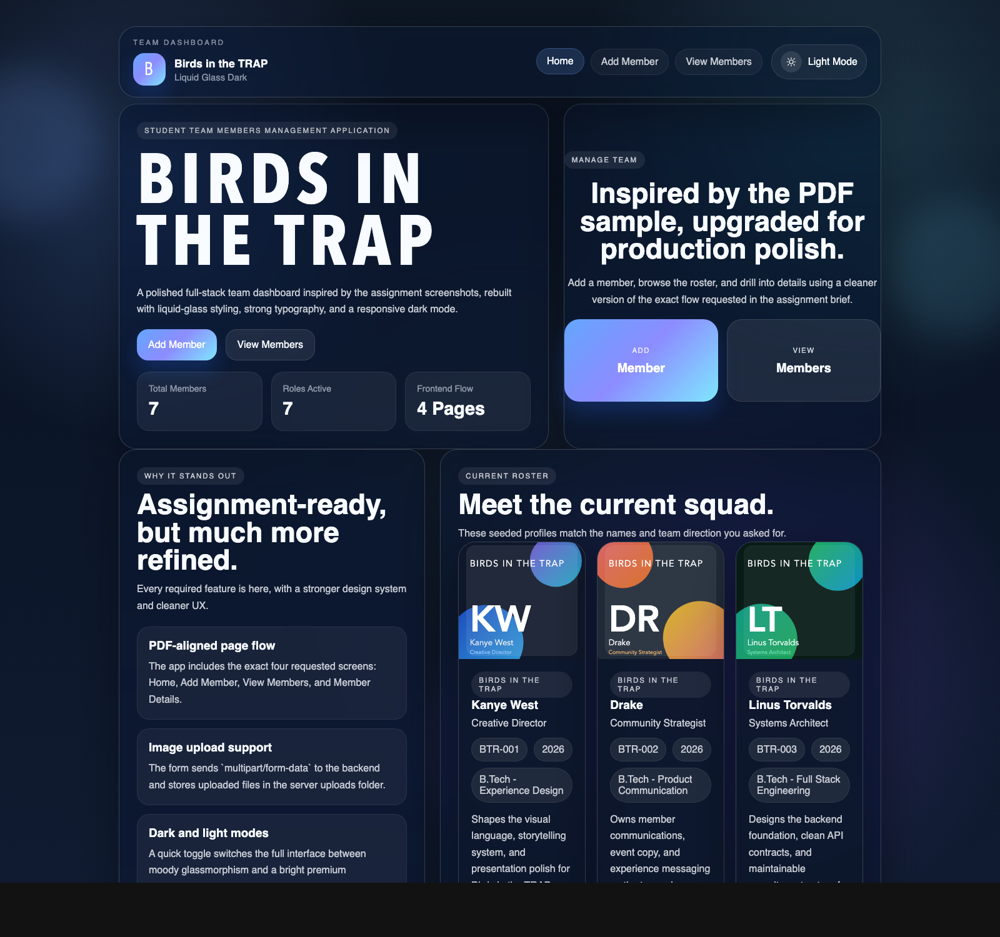
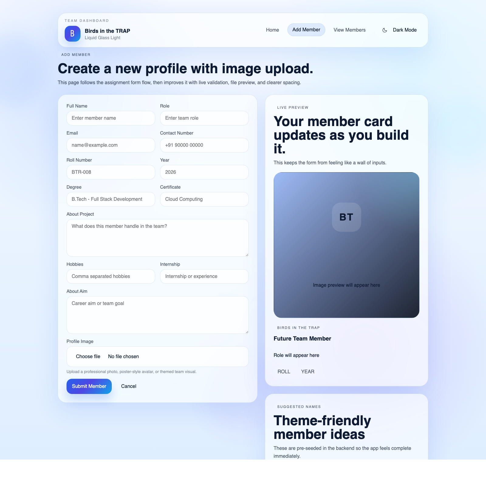
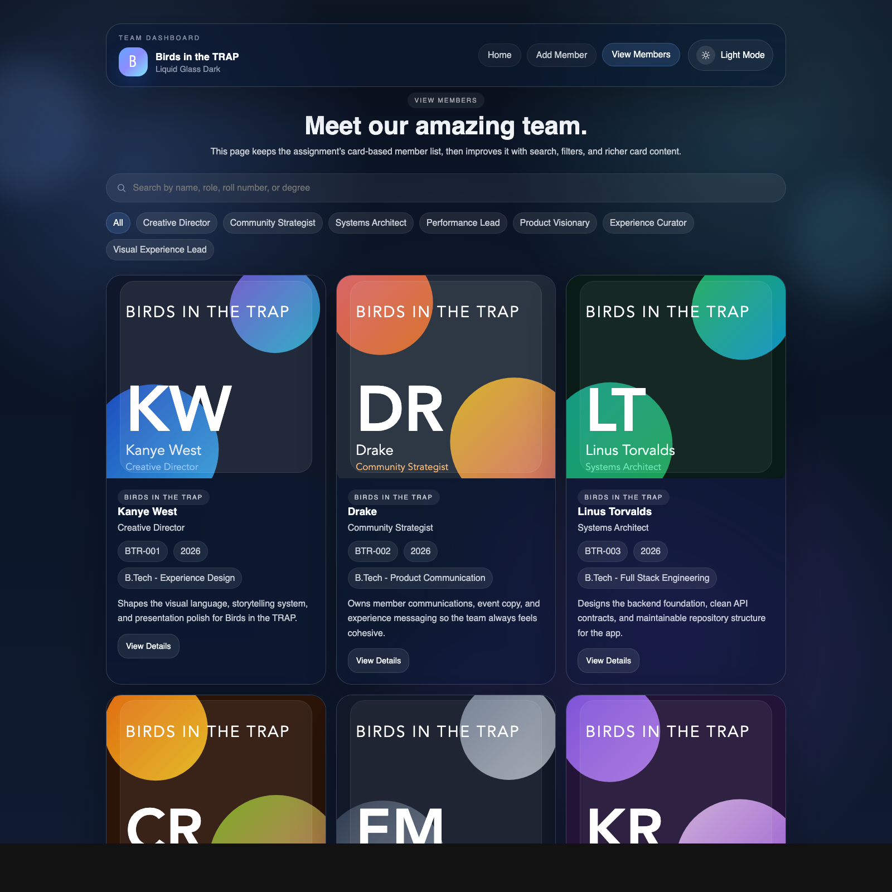
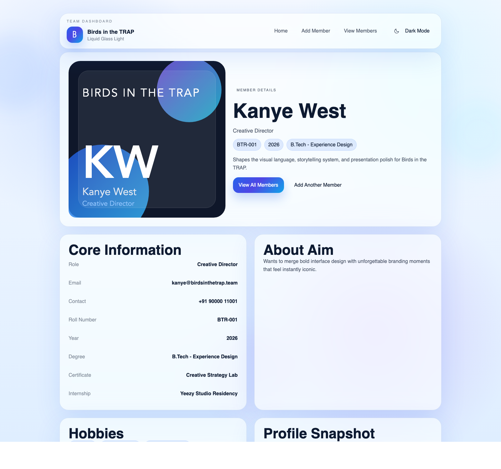

# Birds in the TRAP

Student Team Members Management Application built for the Full Stack Development group assessment.

This project follows the PDF brief page by page, then upgrades the interface with:

- React Router-based navigation for all required pages
- Express API with image upload support
- MongoDB-ready backend with a zero-setup demo JSON fallback
- Apple liquid glass inspired UI treatment
- Light and dark modes
- Seeded team members using the requested notable male names
- A DARKMAN display-font setup with premium fallbacks for the hero typography

## Screenshots

| Dark Home | Light Add Member |
| --- | --- |
|  |  |

| Dark View Members | Light Member Details |
| --- | --- |
|  |  |

If you want to refresh the README screenshots later, replace the files inside `docs/screenshots/` with the same names:

- `home-dark.png`
- `add-light.png`
- `members-dark.png`
- `details-light.png`

## What is included

- Home Page
  Shows the team name, intro copy, primary navigation, and live member stats.
- Add Member Page
  Includes validation, image upload, preview card, and Axios `POST` submission.
- View Members Page
  Fetches members from the backend and shows them in responsive cards with search and role filters.
- Member Details Page
  Fetches one member by ID and renders the full profile view.
- Backend API
  Supports listing members, fetching one member, uploading a new member, and serving profile images.

## Team Setup

- Team name: `Birds in the TRAP`
- Seeded members:
  Kanye West, Drake, Linus Torvalds, Cristiano Ronaldo, Elon Musk, Keanu Reeves, Travis Scott

## Tech Stack

| Layer | Tools |
| --- | --- |
| Frontend | React, React Router, Axios, Vite |
| Backend | Node.js, Express, Multer |
| Database | MongoDB with Mongoose support |
| Fallback storage | Local JSON file for quick demo mode |
| Styling | Custom CSS, glassmorphism, dark/light theming |

## Project Structure

```text
FSD_assignment/
├── backend/
│   ├── data/
│   ├── src/
│   │   ├── controllers/
│   │   ├── data/
│   │   ├── models/
│   │   ├── routes/
│   │   ├── store/
│   │   └── utils/
│   ├── uploads/
│   ├── .env.example
│   └── server.js
├── docs/
│   └── screenshots/
├── frontend/
│   ├── src/
│   │   ├── components/
│   │   ├── context/
│   │   ├── data/
│   │   ├── lib/
│   │   ├── pages/
│   │   └── styles/
│   ├── index.html
│   └── vite.config.js
├── package.json
└── README.md
```

## Routes

### Frontend pages

- `/`
- `/add-member`
- `/view-members`
- `/member/:id`

### Backend APIs

- `GET /api/health`
- `GET /api/members`
- `GET /api/members/:id`
- `POST /api/members`

Legacy aliases are also available under `/members` on the backend for brief compatibility and browser testing.

## How to run

### 1. Install dependencies

From the project root:

```bash
npm install
npm install --prefix backend
npm install --prefix frontend
```

### 2. Configure the backend

Create a backend env file from the sample:

```bash
cp backend/.env.example backend/.env
```

Default values:

```env
HOST=127.0.0.1
PORT=5000
MONGO_URI=mongodb://127.0.0.1:27017/birds-in-the-trap
CLIENT_URL=http://127.0.0.1:5173
AUTO_SEED=true
```

### 3. Choose your storage mode

- MongoDB mode:
  Start MongoDB locally and keep `MONGO_URI` active in `backend/.env`
- Demo mode:
  Leave MongoDB unavailable and the app will automatically use `backend/data/demo-members.json`

This fallback was added so the project still opens and works cleanly during review, while preserving proper MongoDB support for the actual assignment requirement.

### 4. Start the app

Run both servers together from the root:

```bash
npm run dev
```

Or run them separately:

```bash
npm run dev --prefix backend
npm run dev --prefix frontend
```

### 5. Open the app

- Frontend: `http://127.0.0.1:5173`
- Backend: `http://127.0.0.1:5000`
- Members API test: `http://127.0.0.1:5000/api/members`

## Seed data

To reset the seeded members:

```bash
npm run seed
```

## Build the frontend

```bash
npm run build
```

The production-ready frontend output will be created in `frontend/dist`.

## Notes

- Uploaded files are stored inside `backend/uploads/runtime/`
- Seed artwork lives inside `backend/uploads/`
- The members page mirrors the PDF card-style output but adds search and filter controls
- The interface supports `?theme=light` and `?theme=dark` in the URL, which is useful for screenshot capture or quick theme previews

## Submission checklist

- Public GitHub repository
- `.gitignore` included
- `README.md` included
- Frontend + backend folders present
- API routes working
- Image upload working
- All required pages implemented

